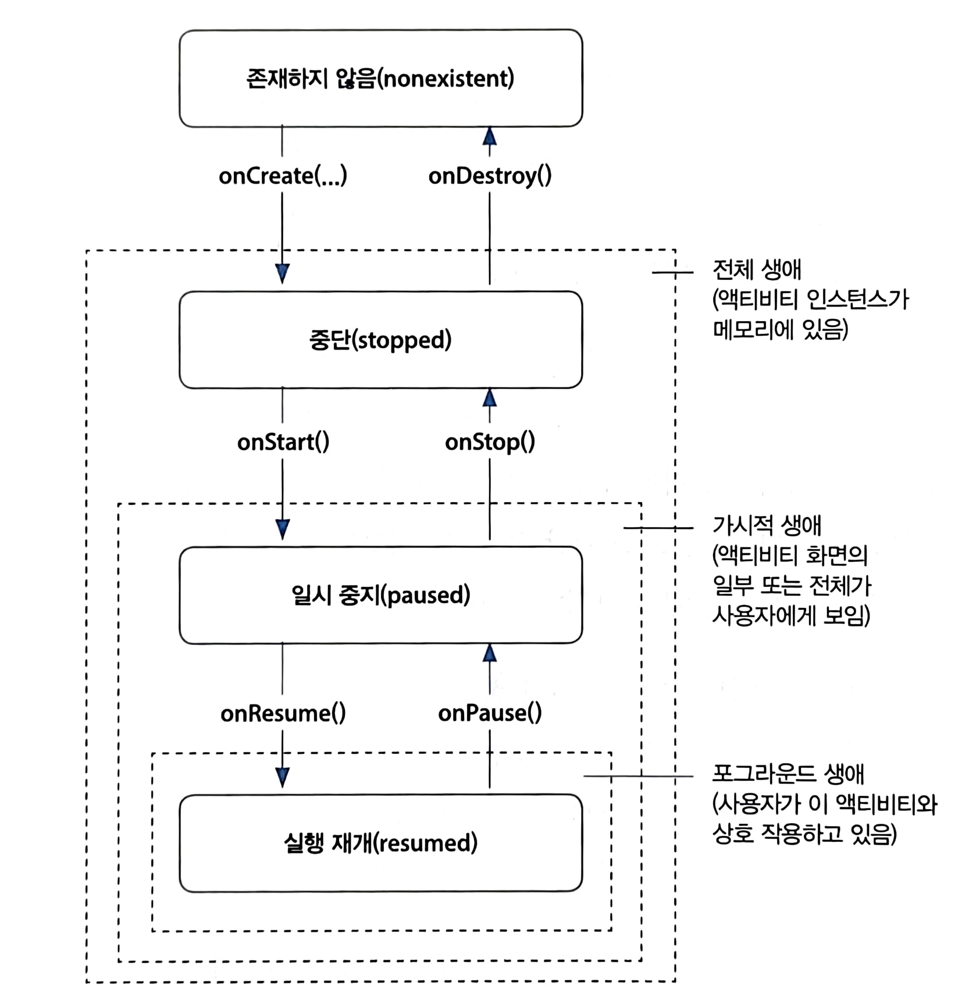
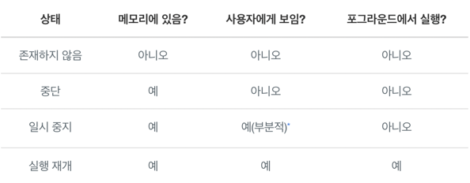

# 액티비티 생명주기

- 장치 회전 문제
  - 장치가 회전되면, 액티비티가 다시 실행된다.
- 액티비티의 모든 인스턴스는 생명주기를 갖는다.
  - 생명주기 동안 4가지 상태를 갖는다.
    - Resumed
      - 화면 최상단에 보일 때,
      - 사용자가 현재 상호작용하고 있는 액티비티
    - Paused
      - 액티비티가 최상단에서 보이지는 않지만, 보이기는 할 때,
      - 액티비티 위에 대화상자
      - 분할 화면 모드
    - Stopped
      - 액티비티 인스턴스 뷰가 화면에서 가려졌을 때,
      - 전체화면을 사용하는 다른 액티비티로 넘어가거나
      - 홈버튼을 눌렀을 때
    - Nonexistent
      - 사용자가 백버튼을 눌렀을 때
      - destroyed 상태 라고도 한다.

- `onCreate()`와 같은 함수들을 사용해 액티비티의 상태 변화 시점에 필요한 일을 처리할 수 있다.
  - 이런 함수들을 lifecycle callback 이라고 한다.
  - 안드로이드 운영체제가 이 함수들을 호출한다.

- 화면 회전 시 안드로이드 운영체제는 왜 액티비티를 소멸시킬까
  - 장치를 회전하면 device configuration 이 변경된다. 
    - 화면 방향, 화면 밀도, 화면 크기, 키보드 타입, dock 모드, 언어 등이 있다.
  - 새로운 구성에 더 잘맞는 리소스를 찾는다.
    - 같은 이미지라도, 해상도에 따라 여러개를 넣을 수 있다. 화면 밀도를 고려해 선택할 수 있도록
  - 현재 액티비티를 소멸시키고 새로운 구성에 맞는 리소스들을 사용해 해당 액티비티의 새 인스턴스를 다시 빌드한다.
  - 
